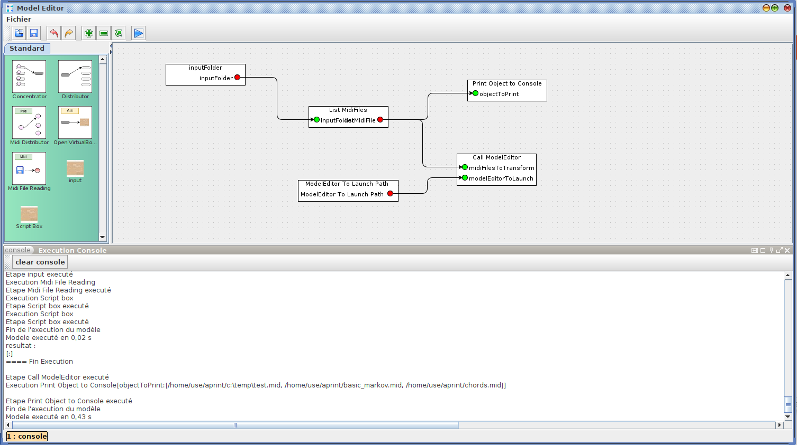
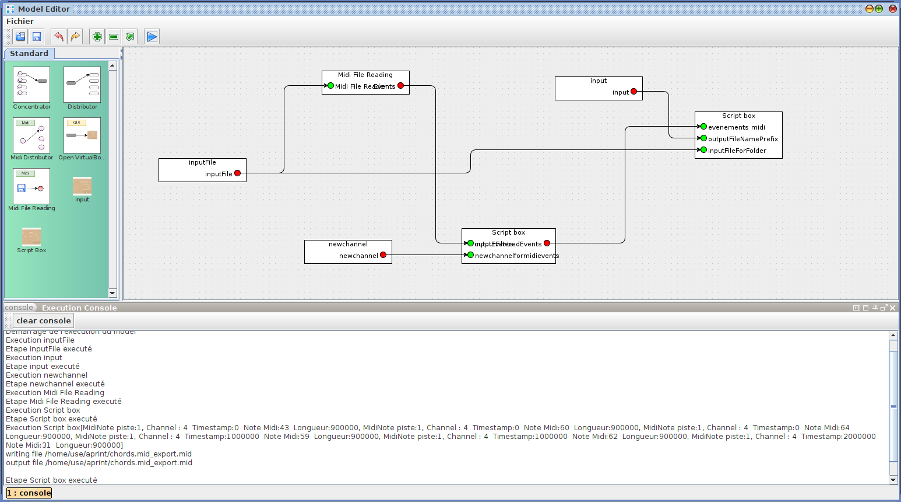

# Sample for executing a modeleditor for a folder

Nota : This example use version 2022.01 and up. (using the synchronous execution method, only available on the 2022 version).

This example shows how to "batch process" each midifile of a folder

The main "execute_model_multiple_midi_files.model" takes a folder containing midifile, load each midifile, transform it and write it back. This model show how to load a complementary model and delegate the transformation.

A second model "midi_filtering_and_write.model" transform the midi file. This second model is used by the former one for the processing.

This method is used here to transform midifiles, it can be used on other files.

The transforming model takes a midi file in input, load the midi file. A script box, move the events to a new channel, and the latest script box write it back to the input folder, with the `_export.mid` suffix

