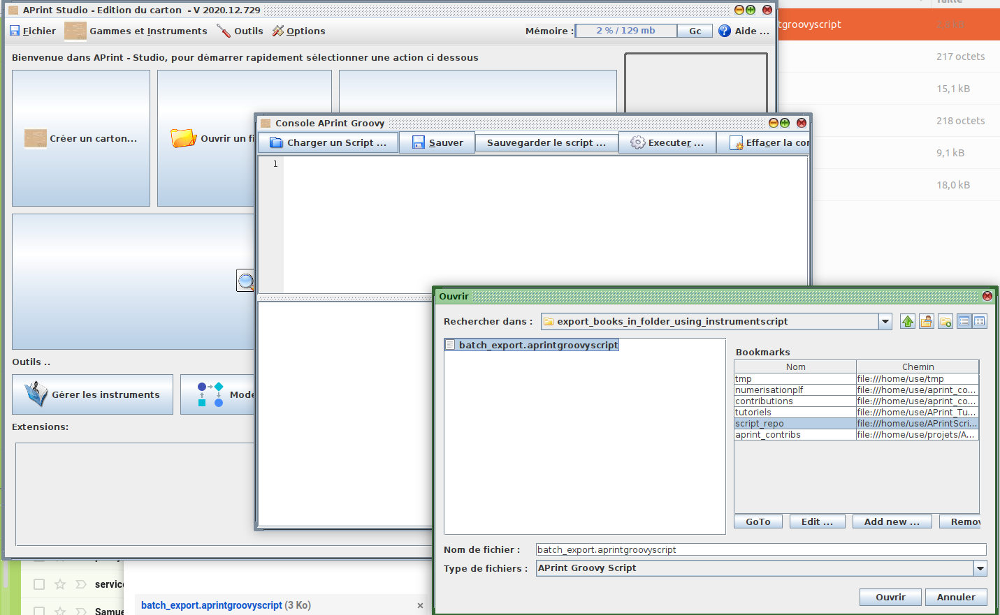

# Batch export mid from instrument export output

This script takes a folder containing book files, and export them in mid, using the first export script defined in the instrument.

To use the script, go to the main menu, and choose Tools / Console 

When the script console is opened, load the script

Then execute

Once the script is executed, the script display a window, for choosing the folder containing the book files

Once choosed, click "execute", 

the result is in the folder, every book files must have its associated .mid with the same name

