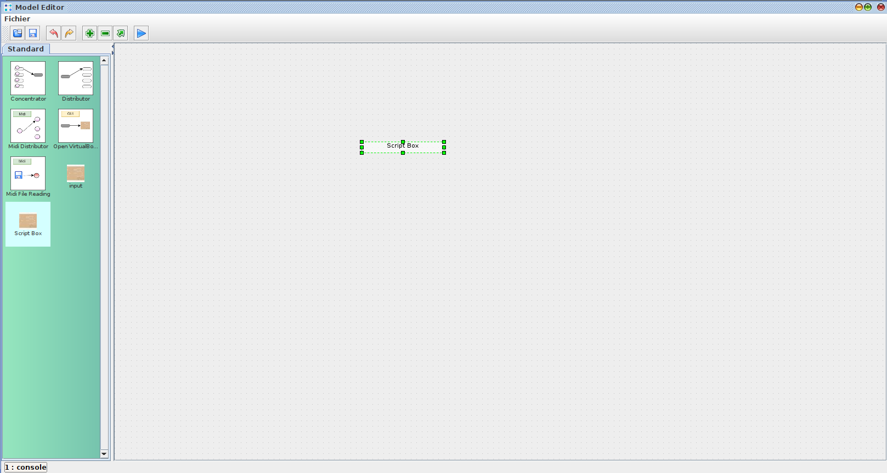
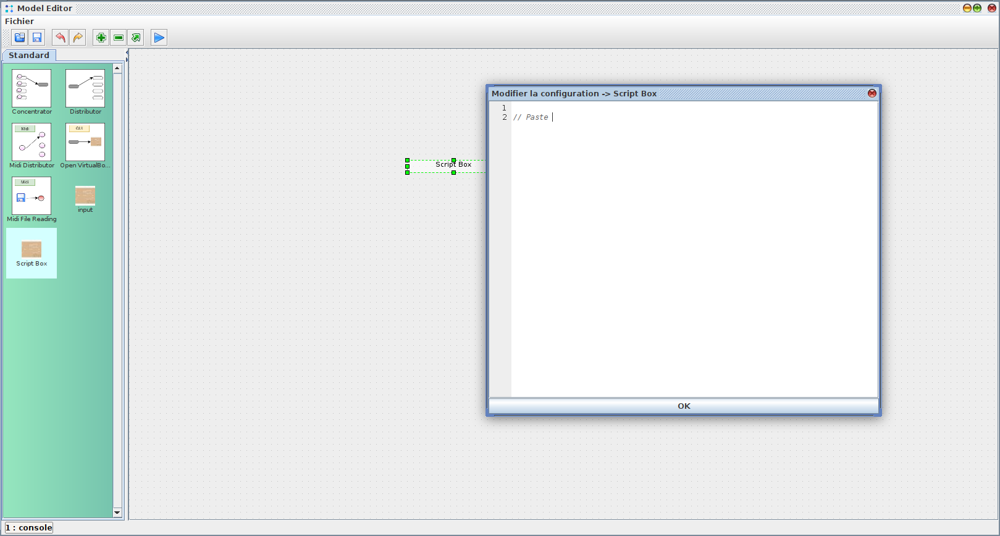

# Model editor scripting box

These scripts enhance the regular processor, and provide additional functionnalities

HowTo Use the .scriptbox files

Open the model editor, and drag a script box on the workbench

Double click on the script box, 

Then paste the content of the script inside, then click OK

the new processor is now ready to use, 