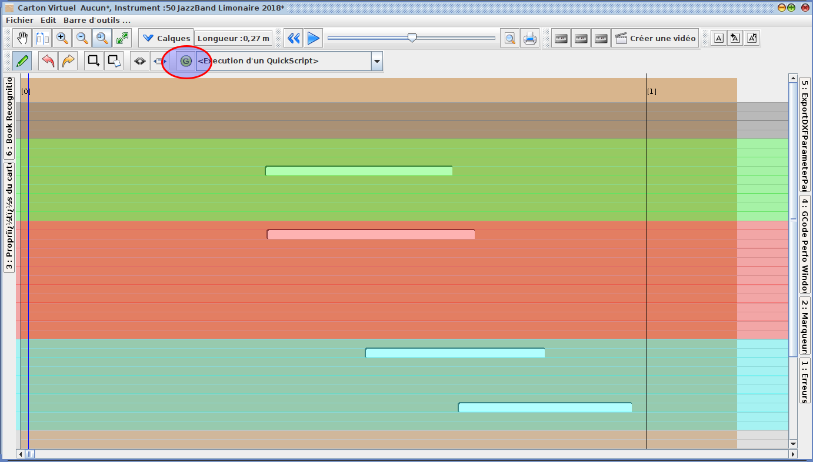
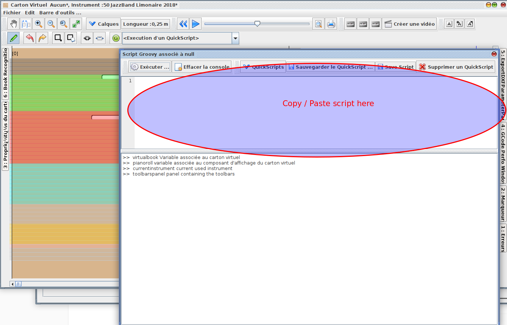

# QuickScript

These scripts can be used in the book window, to transform, adjust, add, analyze the books

two methods to use scripts :

### Method 1 : Drag And drop the .groovyscript file to the main window

Drag the `.groovyscript` file to the main window, 

then the script will be installed and available in the script combo, on the virtualbook window

### Method 2 : copy /paste into the quickscript console

in book window, 

- open the quickscript groovy console

  

  

- paste the script

